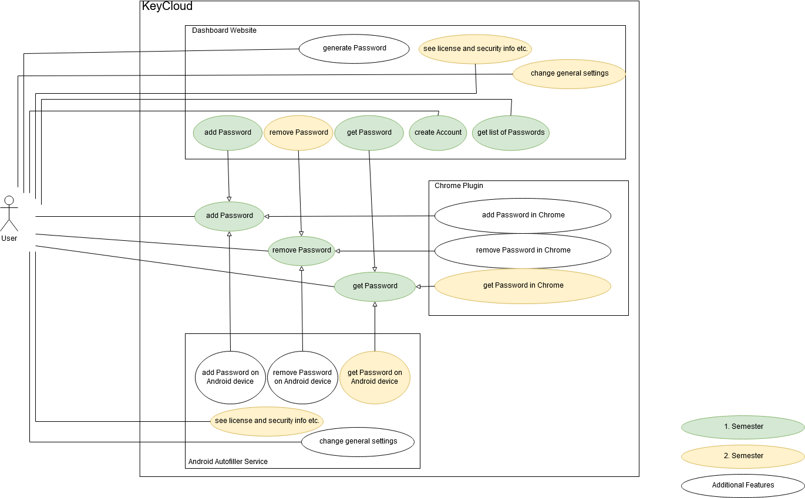
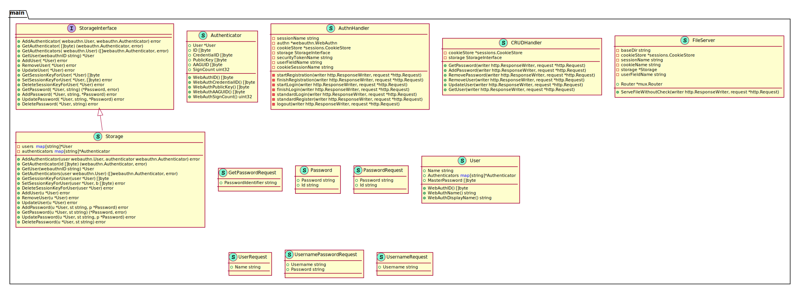
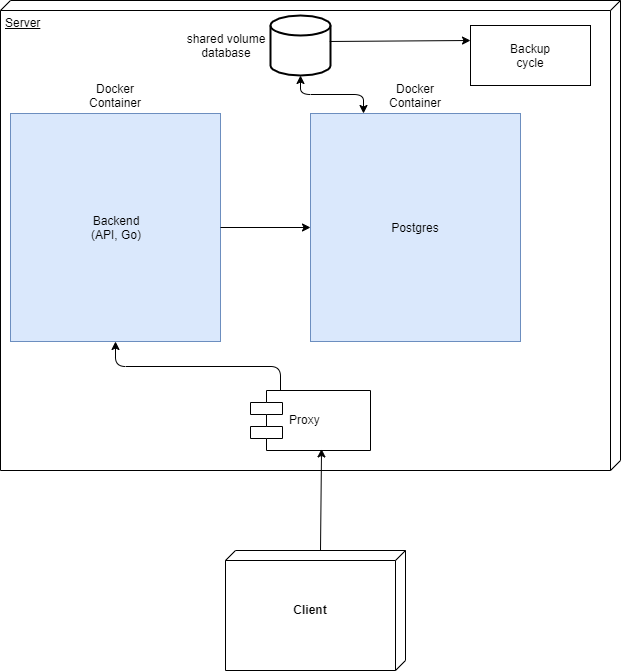

# KeyCloud  - Software Architecture Document

## Table of Contents
- [1. Introduction](#1-introduction)
    - [1.1 Purpose](#11-purpose)
    - [1.2 Scope](#12-scope)
    - [1.3 Definitions, Acronyms and Abbreviations](#13-definitions-acronyms-and-abbreviations)
    - [1.4 References](#14-references)
    - [1.5 Overview](#15-overview)
- [2. Architectural Representation](#2-architectural-representation)
    - [2.1 Technologies used](#21-technologies-used)
- [3. Architectural Goals and Constraints](#3-architectural-goals-and-constraints)
- [4. Use-Case View](#4-use-case-view)
    - [4.1 Use-Case Realizations](#41-use-case-realizations)
- [5. Logical View](#5-logical-view)
    - [5.1 Overview](#51-overview)
- [6. Process View](#6-process-view)
- [7. Deployment View](#7-deployment-view)
- [8. Implementation View](#8-implementation-view)
    - [8.1 Overview](#81-overview)
    - [8.2 Layers](#82-layers)
- [9. Data View](#9-data-view)
- [10. Size and Performance](#10-size-and-performance)
- [11. Quality](#11-quality)

## 1. Introduction
### 1.1 Purpose
This document provides an architectural overview of the system, using a number of different architectural views.
### 1.2 Scope
The scope of this SAD is to show the overall architecture of the KeyCloud project. Use-Cases, classes used in the backend and the database structure are depicted.
### 1.3 Definitions, Acronyms and Abbreviations
Abbreviation | |
--- | --- 
IDE | Integrated Development Environment
MVC | Model View Controller
n/a | not applicable  
SAD | Software Architecture Document
SRS | Software Requirements Specification
tbd | to be determined
UC | Use Case

Definition | |  
--- | ---  
Software Architecture Document | The Software Architecture Document provides a comprehensive architectural overview of the system, using a number of different architectural views to depict different aspects of the system.
### 1.4 References
Title | Date | Publishing organization |  
--- | :---:  | ---
[KeyCloud Blog](https://keycloud.zeekay.dev/) | 12.10.2019 | KeyCloudTeam  
[YouTrack Instance](https://keycloud-dev.zeekay.dev:7000/issues) | 12.10.2019 | KeyCloud  
[SRS](../doc/SRS.md) | 12.10.2019 | KeyCloud  
[SAD](../doc/SAD.md) | 19.11.2019 | KeyCloud  
[TeamCity](http://shared.zeggiedieziege.de:10000/) | 19.11.2019 | KeyCloud
### 1.5 Overview
This document contains the architectural representation, goals and constraints.

## 2. Architectural Representation
Our application is build using Golang in the backend and HTML, CSS and plain JavaScript (cosmetics are made using bootstrap). 
Because Golang is a multi-paradigm language which mainly works functional, we do not have relationships between our classes. 
This is also the reason why we don't have a MVC architecture. Nevertheless, we tried our best to divide our classes up in these three categories.
### 2.1 Technologies used
IDEs:
- Frontend: JetBrains WebStorm
- Backend: JetBrains GoLand

Languages:
- Frontend: JavaScript, HTML, CSS
- Backend: Golang
- Database: Sqlite
- Testing: Java (Cucumber), Golang

## 3. Architectural Goals and Constraints
n/a

## 4. Use-Case View

### 4.1 Use-Case Realizations
tbd

## 5. Logical View
The following graphic describes the overall class organization of the backend.  

### 5.1 Overview

## 6. Process View
n/a

## 7. Deployment View  

## 8. Implementation View
n/a
### 8.1 Overview
n/a
### 8.2 Layers
n/a

## 9. Data View
The following diagram describes the relationship model of our database.  

## 10. Size and Performance
tbd

## 11. Quality
tbd