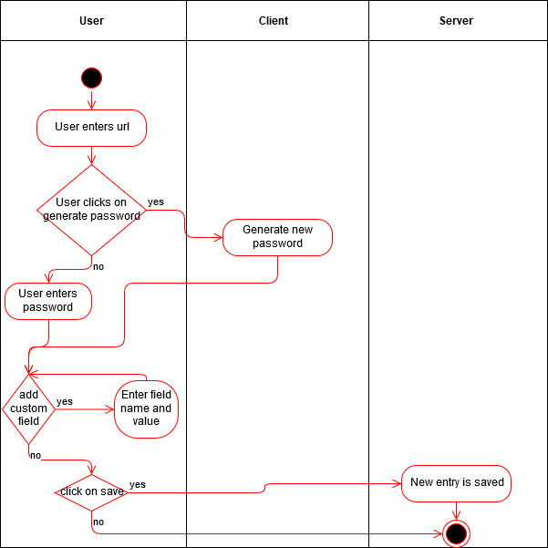
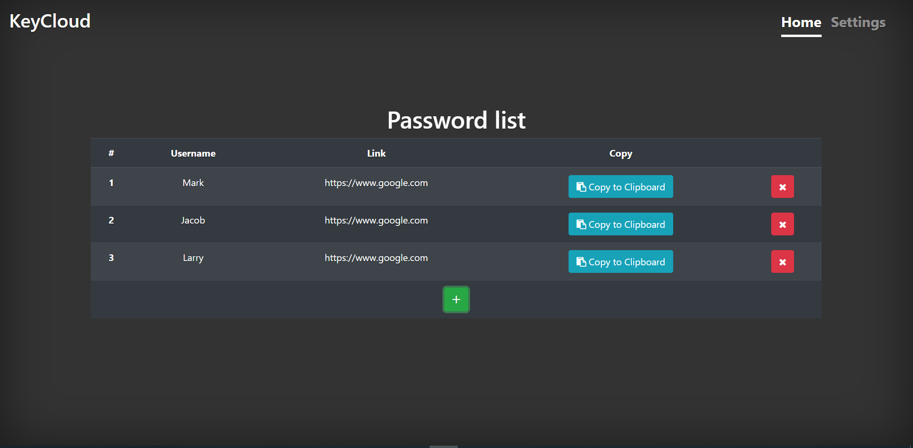

## Revision History
Date | Version | Description | Author
--- | --- | --- | ---
23.10.2019 | 1.0 | First release of the UC | Philipp Heil
23.10.2019 | 1.1 | Add mock ups and activity diagram | Lukas Priester

## Table of Contents
- [1. Use Case Create Account](#1-use-case-create-account)
  - [1.1 Brief Description](#11-brief-description)
- [2. Flow of Events](#2-flow-of-events)
  - [2.1 Basic Flow](#21-basic-flow)
  - [2.2 Alternative Flows](#22-alternative-flows)
- [3. Sepcial Requirements](#3-special-requirements)
- [4. Preconditions](#4-preconditions)
- [5. Postconditions](#5-postconditions)
- [6. Extension Points](#6-extension-points)

## 1. Use-Case Add Password
### 1.1 Brief Description
This use case allows the user to add passwords to his depot. Therefore some information are 
mandatory and additional data fields can be generated by the user.

## 2. Flow of Events
### 2.1 Basic Flow
- User clicks add data button
- User is prompted for an entryname and a password
- User can either insert a password or generate a new one
- Additionally the user can generate new data fields and insert data
#### 2.1.1 Activity Diagram

#### 2.1.2 Mock up
##### Table view of passwords with add button

##### Input prompt

### 2.2 Alternative Flows
n/a

## 3. Special Requirements
n/a

## 4. Preconditions
User has to be logged in.

## 5. Postconditions
After confirming the data its stored on the backend.

## 6. Extension Points
n/a
